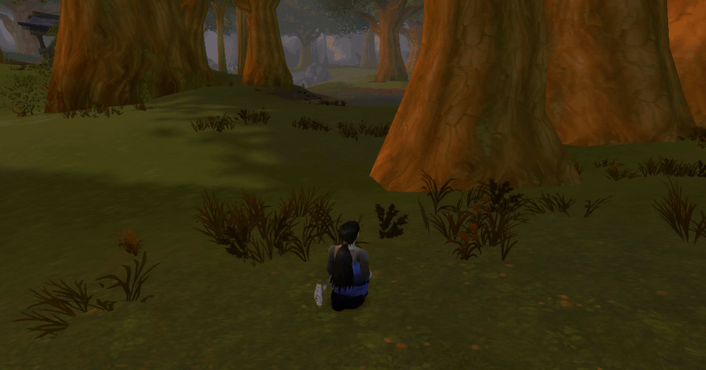

# comfygrass

comfygrass is a modification for the World of Warcraft 1.12 client. It makes the grass move in the wind. The grass also moves away from your character when you walk through it.



The grass in the 1.12 client does not move. comfygrass gives the client a new vertex shader. The graphics processor then moves each blade of grass. comfygrass uses approximately 0.15 milliseconds of each frame. You cannot see a decrease of the frame rate.

My girlfriend does not play a game if the grass does not move. This is the reason for comfygrass.

## Before you install comfygrass

You must have these items:

- A World of Warcraft 1.12 client that starts with the VanillaFixes program.
- DXVK. If you have DXVK, the client folder contains a file with the name `d3d9.dll`.

This is the normal configuration of a Turtle client.

## How to install comfygrass

**CAUTION: CLOSE THE GAME BEFORE YOU COPY THE FILES. WINDOWS CANNOT REPLACE A DLL FILE WHEN A PROGRAM USES IT. WINDOWS DOES NOT SHOW AN ERROR. THE CLIENT CONTINUES TO USE THE OLD FILE.**

1. Close the game.
2. Copy the file `comfygrass.dll` to the client folder. The client folder contains the file `WoW.exe`.
3. Copy the file `comfygrass.ini` to the same folder.
4. Open the file `dlls.txt` in the same folder.
5. Add this line to the file:

   ```
   comfygrass.dll
   ```

6. Delete the file `dlls.txt.cache`. The VanillaFixes program keeps a list of paths in this file. It makes the file again when it starts.
7. Start the game with the `VanillaFixes.exe` program.

comfygrass does not change the other files in the client folder. It does not replace DXVK.

## How to make sure that comfygrass operates

comfygrass writes the file `comfygrass.log` in the client folder. Open this file. The first three lines must be the same as these lines:

```
comfygrass loaded
device hooked
attach succeeded in 254 ms
```

The time in the third line can be different.

## How to remove comfygrass

1. Close the game.
2. Delete the line `comfygrass.dll` from the file `dlls.txt`.
3. Delete the file `dlls.txt.cache`.
4. Delete the file `comfygrass.dll`.

The client then operates as it did before you installed comfygrass.

## How to change the movement

The file `comfygrass.ini` contains the values that control the movement. This file is in the client folder with `comfygrass.dll`.

To use new values, push the F10 key two times in the game. The first push reads the file and stops the effect. The second push starts the effect again. You do not have to start the game again.

Change the values in this sequence:

| Value | Function |
| --- | --- |
| `scale` | The strength of the wind. Change this setting first. A larger value makes more movement |
| `speed` | The speed of the waves. Increase this value if the movement is too slow |
| `lean` | A constant angle of the grass in the direction of the wind |
| `wavelength` | The length of the waves. A small value makes small areas of movement. A large value makes large waves |
| `radius` | The distance around your character where the grass moves away, in yards |
| `forceCenter` | The quantity of movement at the position of your character |
| `anchor` | The part of each blade that does not move. Increase this value if the bottom of the grass moves |

## Grass density

The client controls the density of the grass. comfygrass does not control the density. The client draws the grass when comfygrass is not installed. comfygrass only makes the grass move.

You can change the density with one of these two methods:

- Type `/console frilldensity 32` in the game. You can use the values 1 to 256.
- Install the addon in the folder [`addon/ComfyGrass`](addon/ComfyGrass). Copy this folder to `Interface\AddOns`. The addon adds a **Foliage Density** control to the video options, below **Environment Detail**. The addon also operates when comfygrass is not installed.

The client draws 64 groups of grass for each unit of density. The maximum quantity is 8192 groups. A value more than 128 does not increase the quantity.

Decrease the density if you want a larger frame rate. The density controls the frame rate more than comfygrass.

The standard video controls do not change the density of the grass. The **Environment Detail** control changes the `smallCull` variable. This variable removes small objects at a distance.

## Notes

- comfygrass moves only the grass. Trees and other objects use the same vertex format. comfygrass uses the world matrix to find the difference. It does not move these objects.
- The addresses in `comfygrass.ini` are correct for one `WoW.exe` file only. comfygrass reads the camera position and the character position from the memory of the client. A different client has different addresses. comfygrass examines each value before it uses the value. If a value is not correct, comfygrass does nothing.
- comfygrass does not send data on a network. It does not change the game files.
- Ask the operator of your server if you can use this modification. comfygrass is the same type of modification as nampower or UnitXP.

## How to build comfygrass

You must have Visual Studio 2022 and CMake. Build comfygrass for 32 bits.

```
cmake -B build -A Win32
cmake --build build --config Release
```

CMake writes the file `comfygrass.dll` to this folder, with the file `comfygrass.ini`.

The file [`src/README.md`](src/README.md) gives the technical data. It tells you how comfygrass finds the grass. It also gives the addresses that comfygrass reads from the `WoW.exe` file, and the test for each address. It tells you which three designs did not operate correctly.

## Licence

comfygrass uses the GPL-3.0 licence. Refer to the file [LICENSE](LICENSE).

---

This document uses ASD-STE100 Simplified Technical English.
